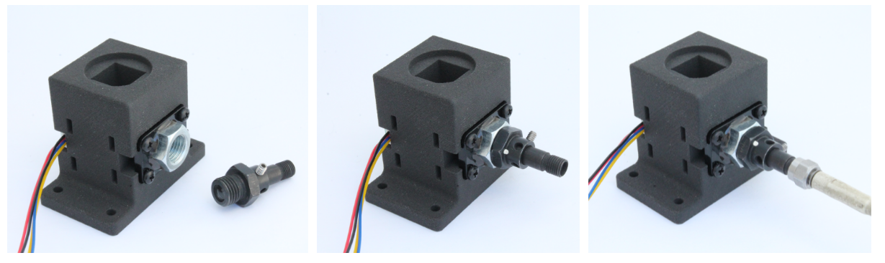

# cuvette_spectro_mount 

Hardware design (FreeCAD) for a simple lasercut adapter plate enabling a USB
spectrometer to be attached to IO Rodeo's cuvette holder.  

# License: 
Creative Commons Attribution 4.0 International CC BY 4.0

